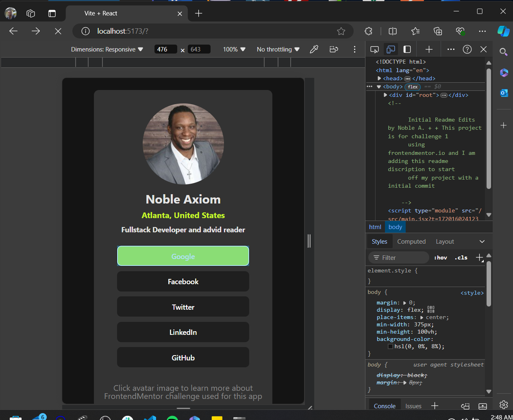

# Frontend Mentor - Social links profile solution

This is a solution to the [Social links profile challenge on Frontend Mentor](https://www.frontendmentor.io/challenges/social-links-profile-UG32l9m6dQ). Frontend Mentor challenges help you improve your coding skills by building realistic projects.

## Table of contents

- [Overview](#overview)
  - [The challenge](#the-challenge)
  - [Screenshot](#screenshot)
  - [Links](#links)
- [My process](#my-process)
  - [Built with](#built-with)
  - [What I learned](#what-i-learned)
- [Author](#author)

**Note: Delete this note and update the table of contents based on what sections you keep.**

## Overview

For this small Social links profile project, I have built out a social link-sharing profile app personalized with my name and connecting buttons with links to major social media platforms to be connected to my social media profiles at a later date!

### The challenge

Users should be able to:

- See hover and focus states for all interactive elements on the page

### Screenshot

### Links

- Solution URL: [Add solution URL here](https://your-solution-url.com)
- Live Site URL: [Add live site URL here](https://your-live-site-url.com)

## My process

### Built with

- CSS
- Javascript
- [vite](https://vitejs.dev/)
- [React](https://reactjs.org/)
- [Node.js](https://nodejs.org/)

### What I learned

fro this project I was asked to upload the project to a live github public repository. I familiarized a refresher on using git terminal commands to to stage with "git add ." and commit with "git commit" while solidifying a understaanding difference in git running localy on my device compared to being synced with the cloud based platform github. also, I was able to usl HSL versus RGB in my CSS as that was the specifics provided, thus allowing me to grow with the bit of experiance. also, I was able to look in to adding a media tag for a resposive design adjustment.

## Author

Noble Axiomx
